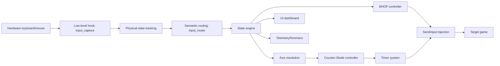
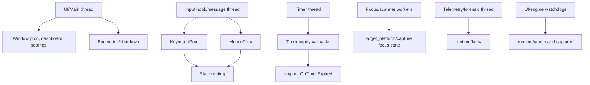
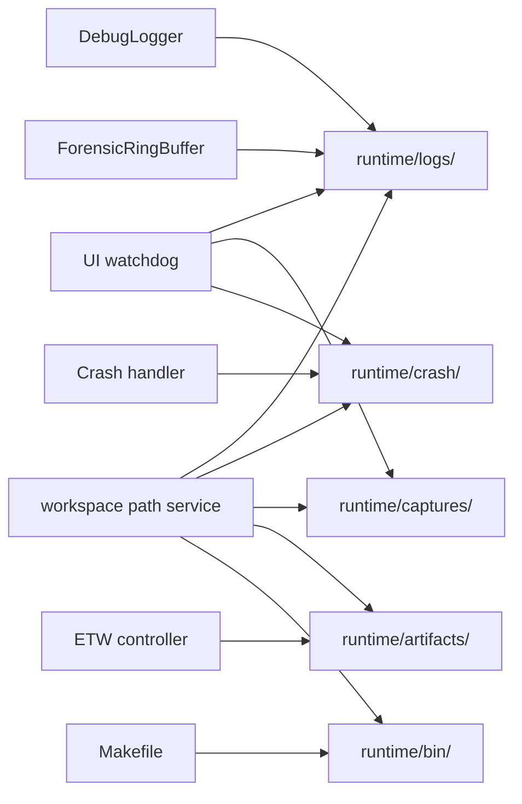
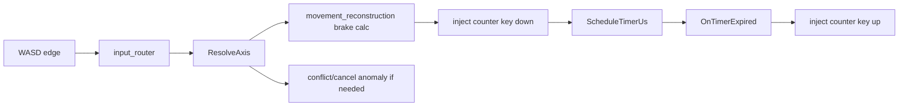
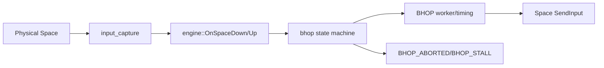

# Marco Project Brain

Date: 2026-05-30
Branch observed: `v27-stabilization`
Mandatory status: this is the first file future AI agents must read before changing the repository.

Evidence base:

- `README.md`
- `docs/REPORT_INDEX.md`
- `docs/ARCHITECTURE_V27.md`
- `docs/INPUT_PIPELINE.md`
- `docs/THREAD_MODEL.md`
- `docs/FOCUS_GATE.md`
- `docs/KNOWN_LIMITATIONS.md`
- `docs/reports/*.md`
- `docs/forensics/*.md`
- `include/core/*`, `include/ui/*`
- `src/core/*`, `src/ui/*`
- `Makefile`, `scripts/`, `tests/`, `tools/`

Evidence rules:

- `FIXED` means a repository report or code path documents the fix. It does not imply live gameplay proof unless that proof is explicitly named.
- `TESTED` means a local build/test/stress command was reported. Mock stress harnesses are not gameplay evidence.
- `NOT TESTED` means no runtime/gameplay evidence was found in the repository.
- `INSUFFICIENT EVIDENCE` means static analysis or mock testing exists, but field/runtime proof is missing.
- `UNKNOWN` means the repository does not contain enough evidence to make the claim.

## Mandatory First Read

Future AI agents must follow these rules before editing:

1. Read this file, then `docs/REPORT_INDEX.md`.
2. Do not patch gameplay from speculation. Collect logs or forensic evidence first.
3. Do not claim `PASS`, `FIXED`, `STABLE`, or `PRODUCTION READY` without execution evidence.
4. Do not treat mock stress tests as gameplay proof.
5. Do not create runtime logs, captures, crash dumps, or artifacts in repository root.
6. Runtime output paths must originate from `workspace::`.
7. Preserve dirty worktree changes unless explicitly told to revert them.
8. Keep infrastructure and observability ahead of optimization when debugging intermittent bugs.
9. If evidence is uncertain, write `UNKNOWN`, `NOT TESTED`, or `INSUFFICIENT EVIDENCE`.

## What Marco Is

Marco Engine is a Windows C++20 input-processing engine for FPS games. Its current code and docs focus on Counter-Strike 2, with target platform support that also defines a Roblox target profile and capability mask in `target_platform`.

Core purpose:

- capture hardware keyboard/mouse input;
- track physical and logical input state;
- resolve WASD axis state;
- execute Counter-Strafe and BHOP behavior;
- schedule precise timer-based key releases;
- inject synthetic input through `SendInput`;
- expose runtime configuration and UI controls;
- record telemetry, debug logs, and forensic anomaly logs for intermittent failure analysis.

Design goals:

- deterministic input ordering;
- low-latency hook processing;
- stability over experimental behavior;
- runtime observability;
- reproducible forensic logs;
- clear separation between source files and runtime artifacts.

Version history from repository evidence:

- V26: documented as a deterministic CS2 physics baseline with regression validation against `tests/regression/golden_outputs/physics_v26_baseline.csv`.
- V27: documented as a rollback/stabilization architecture that removed unstable asynchronous fire delay/subtick fire behavior and prioritized deterministic ordering.
- V27.3: handoff notes report fixes for Focus Passive Gate, BHOP suspend/stuck jump, and timer queue jitter.
- V27.4: handoff and reports document forensic/path infrastructure rework, automatic forensic logs under `runtime/logs/`, and logical/physical reconciliation work. Final V27.4 handoff successfully isolated and patched the Focus Desync bug.

Live gameplay evidence for the latest intermittent Counter-Strafe/BHOP failures: `RESOLVED PENDING LONG-TERM VALIDATION`.

## High-Level Architecture

Primary data flow:



Subsystem summary:

| Subsystem | Purpose | Primary files | Risk |
| --- | --- | --- | --- |
| Input Capture | Windows low-level keyboard/mouse hooks, target focus tracking, swallowed physical input handling | `src/core/input_capture.cpp`, `include/core/input_capture.h` | HIGH |
| Input Router | Routes key up/down and semantic events into engine state | `src/core/input_router.cpp`, `include/core/state_engine.h` | HIGH |
| State Engine | Owns global engine state, publication snapshots, suspend, watchdog, UI notification | `src/core/state_engine.cpp`, `include/core/state_engine.h` | HIGH |
| State Reconciliation | Clears held keys, suspend reconciliation, logical/physical sync on focus regain | `src/core/state_reconciliation.cpp` | HIGH |
| Counter-Strafe | Brake calculation and axis-neutralizing injected input | `src/core/counterstrafe_controller.cpp`, `src/core/movement_reconstruction.cpp` | HIGH |
| BHOP | Space/BHOP state machine and worker lifecycle | `src/core/bhop.cpp`, `include/core/bhop.h` | HIGH |
| Timing | High-resolution timer thread and scheduled key-up callbacks | `src/core/timing.cpp`, `src/core/timer_lifecycle.cpp`, `include/core/timing.h` | HIGH |
| Injection | Sends synthetic keyboard input with `SendInput` | `src/core/injection.cpp`, `include/core/injection.h` | HIGH |
| Runtime Config | Thread-safe runtime configuration snapshots and UI staging | `src/core/runtime_config.cpp`, `include/core/runtime_config.h` | MEDIUM |
| Target Platform | Active game/window identity, capabilities, scanner/resolver workers | `src/core/target_platform.cpp`, `include/core/target_platform.h` | MEDIUM |
| Telemetry/Forensics | Metrics, anomaly ring buffer, auto flush, crash flush | `src/core/telemetry.cpp`, `include/core/telemetry.h` | HIGH |
| Debug Logger | Text debug logging | `src/core/debug_logger.cpp`, `include/core/debug_logger.h` | MEDIUM |
| Workspace Paths | Single source of truth for runtime filesystem paths | `src/core/workspace.cpp`, `include/core/workspace.h` | HIGH |
| UI | Dashboard, settings, diagnostics, analysis views | `src/ui/*.cpp`, `include/ui/*.h` | MEDIUM |

Thread model:



Thread rules from docs:

- Hook callbacks must not block on UI, I/O, or complex work.
- `SendInput` should not happen while holding locks where avoidable.
- Timer callbacks must preserve deterministic ordering.
- UI must not delay input capture or timer dispatch.

Observability and runtime output:



## Directory Map

| Directory | Purpose | Owner | Dependencies | Runtime role |
| --- | --- | --- | --- | --- |
| `src/core/` | Core engine implementation | C++ engine | Win32, runtime config, telemetry, workspace | Runtime source |
| `include/core/` | Core headers and subsystem interfaces | C++ engine | Shared by core/UI/tests | Runtime interfaces |
| `src/ui/` | Win32 UI, dashboard, settings, diagnostics | UI/diagnostics | core snapshots, runtime config, telemetry | Runtime source |
| `include/ui/` | UI headers, theme, build flags | UI/build | Win32, core snapshots | Runtime interfaces |
| `docs/` | Stable architecture docs and report index | Engineering | source/reports | Source documentation |
| `docs/forensics/` | Historical forensic investigations and stress reports | Forensics | source, tests, logs | Source documentation |
| `docs/reports/` | Architecture, logging, path, sanitation, release reports | Release engineering | whole repo | Source documentation |
| `tests/unit/` | C++ unit tests | Test engineering | core headers | Test source |
| `tests/regression/` | Golden regression data | Test engineering | scripts/tools | Test fixtures |
| `tests/forensics/` | Python simulators, fuzzers, visualizers | Forensics/test | runtime artifacts | Test/tool source |
| `tools/forensics/` | Standalone deterministic simulator | Tooling | core/math | Tool source |
| `tools/archive/` | Archived one-off maintenance scripts | Tooling | none at runtime | No runtime role |
| `scripts/test/` | Batch/Python test runners and validators | Release/test | build outputs, tools | Test automation |
| `runtime/bin/` | Built executables | Build/runtime | Makefile | Runtime output, ignored |
| `runtime/logs/` | Debug, forensic, watchdog logs | Observability | workspace path service | Runtime output, ignored |
| `runtime/artifacts/` | ETW, traces, CSVs, generated graphs | Tooling/forensics | workspace path service | Runtime output, ignored |
| `runtime/captures/` | Screenshots and non-crash captures | Diagnostics | workspace path service | Runtime output, ignored |
| `runtime/crash/` | Crash logs and dumps | Crash diagnostics | workspace path service | Runtime output, ignored |
| `build/` | Object files/intermediate build output | Build system | Makefile | Build output, ignored |

## Important File Map

| File | Purpose | Responsibilities | Key functions/types | Dependencies | Risk |
| --- | --- | --- | --- | --- | --- |
| `src/core/main.cpp` | Process entry and lifecycle | startup, crash handler, init/shutdown, message window | `WinMain`, `CrashVectoredExceptionHandler`, `MsgWndProc` | workspace, telemetry, UI, capture, engine | HIGH |
| `src/core/input_capture.cpp` | Low-level input hook and focus gate | keyboard/mouse hooks, swallowed WASD/Space, target active checks, focus transitions | `Install`, `Uninstall`, `KeyboardProc`, `MouseProc`, `PollTarget`, `ReconcileSwallow` | target_platform, engine, bhop, telemetry | HIGH |
| `src/core/input_router.cpp` | Semantic input routing | key down/up handling, sys key/shift/space routing, logical state transitions | `HandleKeyDown`, `HandleKeyUp`, `OnSpaceDown`, `OnSpaceUp` | state engine internals, injection, bhop | HIGH |
| `src/core/state_engine.cpp` | Engine state owner | state publication, UI notification, suspend flag, watchdog, snapshots | `Init`, `TakeSnapshot`, `PublishEngineState`, `StartWatchdog`, `TriggerEmergencyFlush` | timing, telemetry, runtime config, UI | HIGH |
| `src/core/state_reconciliation.cpp` | Cleanup and reconciliation | suspend, clear held keys, focus regain state rebuild, logical/physical sync | `ToggleSuspend`, `ClearHeldKeys`, `RebuildState`, `ReconcileInternal` | injection, timing, telemetry, bhop | HIGH |
| `src/core/counterstrafe_controller.cpp` | Counter-Strafe logic | axis neutralization, stale brake cancel, brake injection | `ResolveAxis`, `NeutralizeAxis`, `AutoCounterStrafe`, `ApplyOverlapCounterStrafe` | timing, movement, runtime config, injection | HIGH |
| `src/core/movement_reconstruction.cpp` | Physics/LUT support | velocity estimation, stop duration lookup | `InitLUT`, `EstimateTrueVelocity2D`, `LookupStopDur2D` | runtime config, config defaults | HIGH |
| `src/core/bhop.cpp` | BHOP state machine | mode switching, worker lifecycle, space sync, suspend sync | `Init`, `Shutdown`, `ToggleEnabled`, `CycleMode`, `OnSpaceDown`, `OnSpaceUp`, `ForceSpaceSync` | runtime config, injection, telemetry | HIGH |
| `src/core/timing.cpp` | High-resolution timer engine | timer thread, adaptive wake/spin, scheduling/canceling timers | `Init`, `StartTimerThread`, `StopTimerThread`, `ScheduleTimerUs`, `CancelTimer` | topology, telemetry, engine callbacks | HIGH |
| `src/core/timer_lifecycle.cpp` | Timer expiry bridge | key-up/timer validation path into engine | `engine::OnTimerExpired` | state engine internals, injection, telemetry | HIGH |
| `src/core/injection.cpp` | SendInput wrapper | key down/up/batch construction and dispatch | `KeyDown`, `KeyUp`, `KeyDownUp`, `SendBatch` | Win32 input, keymap | HIGH |
| `src/core/runtime_config.cpp` | Runtime config storage | seqlock-style snapshots, UI staging, safe-mode overrides | `rcfg::Init`, `rcfg::Get`, `rcfg::Apply`, `rcfg::GetMutable` | `RuntimeConfig` | MEDIUM |
| `include/core/runtime_config.h` | Runtime config schema | Counter-Strafe, physics, BHOP, app settings, brake profiles | `RuntimeConfig`, `BrakeProfile`, `ModeTimings` | engine/UI | MEDIUM |
| `src/core/target_platform.cpp` | Target game identity | CS2/Roblox profiles, active target publication, scanner/resolver workers | `Init`, `Shutdown`, `ResolveTargetAsync`, `GetActiveProfile`, `GetRunningGamesMask` | Win32 process/window APIs | MEDIUM |
| `include/core/target_platform.h` | Target platform API | capability flags, game masks, target identity | `TargetProfile`, `TargetIdentity`, `CAP_BHOP`, `CAP_CSTRAFE`, `MASK_CS2`, `MASK_ROBLOX` | capture/UI | MEDIUM |
| `src/core/telemetry.cpp` | Telemetry and forensic logging | ring flush, session header, auto flush, crash flush, metric thread | `InitForensics`, `ShutdownForensics`, `FlushForensicLog`, `ForensicRingBuffer::FlushToFile` | workspace, build_config | HIGH |
| `include/core/telemetry.h` | Telemetry interfaces | metrics, event ring, forensic anomaly schema | `MetricBuffer`, `EventRingBuffer`, `ForensicTrapType`, `ForensicEvent` | source/UI | HIGH |
| `src/core/debug_logger.cpp` | Debug text logger | subsystem log file, flush, formatted lines | `dlog::Init`, `dlog::Write`, `dlog::Flush`, `dlog::Shutdown` | workspace, build_config | MEDIUM |
| `src/core/workspace.cpp` | Runtime path authority | project root discovery, runtime/log/artifact/capture/crash roots, directory creation | `GetRuntimeRoot*`, `GetLogRoot*`, `EnsureRuntimeDirectoriesExist` | Win32 filesystem | HIGH |
| `src/core/etw_controller.cpp` | ETW/performance diagnostics | start/stop kernel trace, analyze trace | `StartGlobalTrace`, `StopGlobalTrace`, `AnalyzeTrace` | workspace, TDH/dbghelp in debug/profile | MEDIUM |
| `src/core/analysis_toolkit.cpp` | Analysis exports | CSV/JSON/baseline export and session comparison | `ExportCSV`, `ExportJSON`, `SaveBaseline`, `CompareSession` | telemetry/event buffers | MEDIUM |
| `src/ui/ui_main.cpp` | Main UI window | tabs, status bar, tray icon, command handling, dashboard refresh | `WndProc`, `RefreshDashboard`, `OnStateChanged`, `Show`, `Hide` | engine, runtime config, UI panels | MEDIUM |
| `src/ui/ui_settings.cpp` | Settings UI | profile buttons, config editing, safe mode, save/apply/reset | `Paint`, `OnCommand`, `OnMouseWheel` | runtime config, config_io | MEDIUM |
| `src/ui/ui_dashboard.cpp` | Dashboard view | runtime state display | `Paint`, `OnMouseWheel`, `Destroy` | runtime snapshots, theme/layout | MEDIUM |
| `src/ui/ui_diagnostics.cpp` | UI watchdog diagnostics | heartbeat, stall log, screenshots, dumps | `StartWatchdog`, `StopWatchdog`, `PaintOverlay` | workspace, dbghelp, Win32 GDI | MEDIUM |
| `include/ui/build_config.h` | Build feature matrix | Debug/Profile/Release flags | `MARCO_ENABLE_*` macros | all compiled units | MEDIUM |
| `Makefile` | Build pipeline | debug/profile/release outputs to `runtime/bin/` | `make debug`, `make profile`, `make release` | MinGW, Win32 libs | MEDIUM |

## System Interaction Map

### Input Travel

1. Hardware input enters Windows.
2. `input_capture` receives low-level keyboard/mouse hook callbacks.
3. Capture layer checks target focus and injected-event filters.
4. Physical state is tracked regardless of semantic route where required.
5. Focused target input routes to `engine::HandleKeyDown`, `engine::HandleKeyUp`, `engine::OnSpaceDown`, `engine::OnLButtonDown`, etc.
6. State engine and controllers update logical state.
7. Counter-Strafe/BHOP/timer logic creates injected key events.
8. `injection` sends events through `SendInput`.
9. State publication updates UI and telemetry.

### Counter-Strafe Flow



Evidence status: core flow is source-backed. Current intermittent failure reports are `SUSPECTED/OPEN` with `INSUFFICIENT EVIDENCE`.

### BHOP Flow



Evidence status: source-backed. Current intermittent BHOP failure reports remain `SUSPECTED/OPEN`.

### Profile Change Flow

1. UI settings changes `RuntimeConfig` staging values.
2. `rcfg::Apply` publishes a new runtime config snapshot.
3. Relevant controllers read config through runtime getters or `rcfg::Get`.
4. Forensic infrastructure has `PROFILE_CHANGED` anomaly support.
5. User reports intermittent failure sometimes after profile changes. Status: `SUSPECTED/OPEN`, `INSUFFICIENT EVIDENCE`.

### Focus Loss/Gain Flow

1. Capture/target platform detects active target transition.
2. Focus lost: clear swallowed/injected keys and flush forensic state.
3. Focus gained: query physical WASD/Space state and reconcile logical state.
4. Forensic events: `FOCUS_LOST`, `FOCUS_GAINED`, `LOGICAL_PHYSICAL_DIVERGENCE`.

Evidence status: focus cleanup and reconciliation are documented as implemented; live gameplay proof for all intermittent failures remains `INSUFFICIENT EVIDENCE`.

### Crash/Forensic Flush Flow

1. Forensic events accumulate in `ForensicRingBuffer`.
2. Auto flush writes incrementally to `runtime/logs/marco_YYYY-MM-DD_HH-MM-SS.log`.
3. Lifecycle flushes are requested on focus loss/gain, profile change, shutdown, and severe crash paths according to forensic reports.
4. Crash marker/dumps go under `runtime/crash/`.
5. Crash-time forensic flushing is best effort.

## Configuration Guide

### Runtime Config

Runtime config is defined in `include/core/runtime_config.h` and implemented in `src/core/runtime_config.cpp`.

Major groups:

- Counter-Strafe timing and physics values;
- walk memory and intent velocity;
- tap spam EMA and micro-tap filtering;
- physics constants;
- watchdog;
- conflict penalty;
- movement evolution/humanization fields;
- brake profiles: Off, Rifle, Pistol, Sniper, SMG;
- BHOP modes and timing;
- app settings including tray, dashboard refresh, debug mode, safe mode.

Runtime access pattern:

- `rcfg::Init()` initializes defaults.
- `rcfg::Get()` returns a snapshot for any thread.
- `rcfg::GetMutable()` is intended for UI-thread staging.
- `rcfg::Apply()` publishes a new config.

Do not modify runtime config behavior casually. The technical debt report documents declaration-only legacy constants in `include/core/config.h`, but removal was explicitly deferred.

### Build Modes

Build system: `Makefile`.

Outputs:

- Debug: `runtime/bin/marco_debug.exe`
- Profile: `runtime/bin/marco_profile.exe`
- Release: `runtime/bin/marco.exe`

Build commands:

```powershell
make debug
make profile
make release
```

Feature flags are defined in `include/ui/build_config.h`.

Known config drift from `docs/reports/CONFIG_DRIFT_AUDIT.md`:

- `MARCO_ENABLE_LOGGING` is defined but no consumer was observed outside definitions/docs.
- `MARCO_ENABLE_ASSERTS` is defined but no consumer was observed outside definitions/docs.
- `MARCO_ENABLE_UI_OVERLAY` is defined but no consumer was observed outside definitions/docs.
- Debug logger currently follows `MARCO_ENABLE_FORENSIC`, not `MARCO_ENABLE_LOGGING`.

Status: documented debt. Do not remove without a dedicated build config cleanup.

### Forensic-Enabled Builds

Current config drift report says `MARCO_ENABLE_FORENSIC` is active in Debug, Profile, and Release. Release excludes some diagnostics/toolkit sources in `Makefile`, but forensic logging remains a required runtime evidence path.

## Forensic History

### Focus Passive Gate

Status: `FIXED` by documentation, gameplay proof not independently verified here.

Cause:

- Alt-tab, settings click, or focus loss could leave held/suppressed state dirty.

Reported fix:

- Trigger cleanup on focus change.
- Clear held keys.

Evidence:

- Handoff notes.
- `docs/FOCUS_GATE.md`.
- focus-related source paths in `input_capture` and `state_reconciliation`.

### Focus Desync / Inverse Ghost Key

Status: `FIXED` by documentation/source intent, but intermittent runtime failures remain `SUSPECTED/OPEN`.

Cause:

- Physical state and logical state could diverge after focus loss and releasing a key outside the game.
- Example: `physical[A] = false` while `logical[A] = true`, producing `AxisState::Conflict`.

Reported fix:

- `ReconcileLogicalStateFromPhysical()`.
- BHOP `ForceSpaceSync()`.

Evidence:

- Handoff notes.
- `src/core/state_reconciliation.cpp`.
- `include/core/bhop.h`.

Runtime evidence:

- Mock stress reports show zero failures.
- Gameplay proof for current intermittent issue: `INSUFFICIENT EVIDENCE`.

### Timer Queue Jitter

Status: `FIXED` by documentation/source intent.

Cause:

- Previous `PostMessage -> WM_TIMER_EXPIRED` path could introduce random delay through the message queue.

Reported fix:

- Timer thread invokes direct callback rather than routing through the UI/message queue.

Evidence:

- Handoff notes.
- `docs/KNOWN_LIMITATIONS.md` notes no generational timers.
- `src/core/timing.cpp` and `src/core/timer_lifecycle.cpp`.

Residual debt:

- `WM_TIMER_EXPIRED` still appears in `include/core/types.h` and comments in `include/core/timing.h`.
- Status: documented drift, not removed.

### BHOP Suspend / Stuck Jump

Status: `FIXED` by documentation/source intent.

Cause:

- Holding Space while suspending could leave injected Space down.

Reported fix:

- Track injected-space state.
- Guarantee key-up path.
- Add `ForceSpaceSync()`.

Evidence:

- Handoff notes.
- `include/core/bhop.h`.
- BHOP forensic events in telemetry.

Runtime evidence:

- Mock stress report: `STRESS_BHOP_REPORT` reports 100 iterations, 0 failures.
- Gameplay proof for current intermittent BHOP issue: `INSUFFICIENT EVIDENCE`.

### OS Hook Stall

Status: historical forensic report. Current status requires source-specific verification before claiming fixed.

Cause reported in `docs/forensics/FINAL_FORENSIC_VERDICT.md`:

- BHOP worker slept while holding `s_bhopMutex`, risking hook blocking when Space events needed the same mutex.

Evidence:

- Forensic verdict report.

Current evidence status:

- `UNKNOWN` without a focused current-source audit.

### Movement Stuck / Timer ID

Status: historical forensic report. Current status requires source-specific verification before claiming fixed.

Cause reported in `docs/forensics/FINAL_FORENSIC_VERDICT.md`:

- Timer ID was not stored into expected state in an AutoFire/counter-strafe path, causing timer callback rejection and stuck movement.

Evidence:

- Forensic verdict report.

Current evidence status:

- `UNKNOWN` without a focused current-source audit.

## Known Risks

### PROVEN

- Runtime output path policy exists: `runtime/logs/`, `runtime/artifacts/`, `runtime/captures/`, `runtime/crash/`, `runtime/bin/`.
- `workspace` is the path authority for implicit runtime output.
- `patch_capture.py` was archived to `tools/archive/patch_capture.py`.
- `docs/reports/TECHNICAL_DEBT_ELIMINATION_REPORT.md` says no uncertain behavior-adjacent code was removed.

### FIXED By Repository Documentation

- Focus Passive Gate cleanup.
- Focus Desync reconciliation path.
- Timer queue jitter message-queue bypass.
- BHOP suspend/stuck jump key-up path.
- Forensic log location ambiguity: forensic logs now use `runtime/logs/marco_YYYY-MM-DD_HH-MM-SS.log`.
- Root `FORENSIC_CAPTURE.log` fallback removed from source according to audit.

### SUSPECTED / OPEN

- Persistent anomaly logging may still be too chatty under repeated anomaly conditions.
- Gameplay validation of V27.4 Focus Desync fix is still ongoing (requires 3-7 days of play).

### NOT TESTED / INSUFFICIENT EVIDENCE

- Current real gameplay reproduction of intermittent Counter-Strafe/BHOP failures.
- Runtime forensic log creation after latest infra refactor, unless a future report adds live evidence.
- Crash-time forensic flush reliability under lock contention or severe process failure.

### Known Technical Debt

- Stale F8 state tracking remains in `input_capture`, while no active F8 handler was found in the latest audit.
- `WM_TIMER_EXPIRED` constant/comment drift remains after direct callback migration.
- `MARCO_ENABLE_LOGGING`, `MARCO_ENABLE_ASSERTS`, and `MARCO_ENABLE_UI_OVERLAY` appear unused.
- Several `include/core/config.h` constants appear declaration-only.
- Some historical reports are superseded but kept for evidence.
- `tests/forensics/fix_includes.py` and `tests/forensics/restructure.py` are maintenance scripts under tests.
- Duplicate ignored executable fixture may exist under `tests/forensics/`; owner confirmation required before deletion.

## Debugging Playbook

### Where Things Are

| Question | Answer |
| --- | --- |
| Where are logs? | `runtime/logs/` |
| Where are forensic logs? | `runtime/logs/marco_YYYY-MM-DD_HH-MM-SS.log` |
| Where is debug log output? | `runtime/logs/marco_debug.log` |
| Where are UI watchdog logs? | `runtime/logs/`, see logging architecture report for exact current filename |
| Where are crash dumps/logs? | `runtime/crash/` |
| Where are screenshots/captures? | `runtime/captures/` |
| Where are generated traces/graphs/CSVs/ETW files? | `runtime/artifacts/` |
| Where are built binaries? | `runtime/bin/` |
| Where is the report index? | `docs/REPORT_INDEX.md` |

### Reports To Read First

For any future work:

1. `PROJECT_BRAIN.md`
2. `docs/REPORT_INDEX.md`
3. `docs/reports/LOGGING_ARCHITECTURE.md`
4. `docs/reports/PATH_GOVERNANCE_REPORT.md`
5. `docs/reports/OBSERVABILITY_MAP.md`
6. `docs/forensics/FORENSIC_INFRA_AUDIT.md`
7. `docs/forensics/LOG_LOCATION_REPORT.md`
8. `docs/reports/TECHNICAL_DEBT_ELIMINATION_REPORT.md`

For gameplay bugs:

1. `docs/ARCHITECTURE_V27.md`
2. `docs/INPUT_PIPELINE.md`
3. `docs/FOCUS_GATE.md`
4. relevant `docs/forensics/STRESS_*` reports
5. source files listed under the owning subsystem below

### Subsystem Ownership

| Symptom | Owning subsystem | Inspect first |
| --- | --- | --- |
| Key stuck after focus change | Focus/capture/reconciliation | `src/core/input_capture.cpp`, `src/core/state_reconciliation.cpp`, `docs/FOCUS_GATE.md` |
| Counter-Strafe does nothing | Router/state/counter-strafe/timing | `src/core/input_router.cpp`, `src/core/state_engine.cpp`, `src/core/counterstrafe_controller.cpp`, `src/core/timing.cpp` |
| Counter-Strafe conflict | Axis resolution/reconciliation | `src/core/counterstrafe_controller.cpp`, `src/core/state_reconciliation.cpp`, forensic log for `COUNTERSTRAFE_CONFLICT` |
| BHOP stops | BHOP/state/capture | `src/core/bhop.cpp`, `src/core/input_router.cpp`, forensic log for `BHOP_ABORTED` or `BHOP_STALL` |
| Failure after profile change | Runtime config/UI/settings | `src/core/runtime_config.cpp`, `src/ui/ui_settings.cpp`, forensic log for `PROFILE_CHANGED` |
| Timer rejected/stale release | Timing/timer lifecycle | `src/core/timing.cpp`, `src/core/timer_lifecycle.cpp`, forensic log for `TIMER_REJECTED` |
| UI freezes | UI diagnostics | `src/ui/ui_diagnostics.cpp`, `runtime/logs/`, `runtime/captures/`, `runtime/crash/` |
| Crash on startup | Main/crash handler/workspace | `src/core/main.cpp`, `runtime/crash/startup_crash.log` |
| Missing logs | Workspace/logging | `src/core/workspace.cpp`, `src/core/telemetry.cpp`, `src/core/debug_logger.cpp` |

### Focus Bug Workflow

1. Collect latest `runtime/logs/marco_*.log`.
2. Look for `FOCUS_LOST`, `FOCUS_GAINED`, and `LOGICAL_PHYSICAL_DIVERGENCE`.
3. Correlate timestamps with user action: alt-tab, settings click, game regain.
4. Inspect `input_capture` focus state, swallowed key state, and `state_reconciliation`.
5. Do not change axis/controller logic until divergence evidence is understood.

### Profile Change Bug Workflow

1. Collect forensic log and `runtime/logs/marco_debug.log`.
2. Search for `PROFILE_CHANGED`.
3. Note active brake profile and runtime config values if logged or visible in UI.
4. Inspect `runtime_config`, `ui_settings`, and controller config reads.
5. Check whether failure happens before or after config apply.

### Counter-Strafe Stall Workflow

1. Collect forensic log.
2. Search for `COUNTERSTRAFE_CANCELLED`, `COUNTERSTRAFE_CONFLICT`, `TIMER_REJECTED`, `LOGICAL_PHYSICAL_DIVERGENCE`.
3. Inspect input route for the exact key edge.
4. Inspect axis state and timer creation/cancel path.
5. Confirm whether injected key-up happened.
6. Only then consider controller/timer changes.

### BHOP Stall Workflow

1. Collect forensic log.
2. Search for `BHOP_ABORTED`, `BHOP_STALL`, focus events, suspend events.
3. Inspect physical Space state versus injected Space state.
4. Inspect `bhop::ForceSpaceSync` calls around focus/suspend.
5. Avoid touching Counter-Strafe unless logs show shared state interaction.

### Timer Anomaly Workflow

1. Check `TIMER_REJECTED`, timer jitter, oversleep, scheduler spike metrics.
2. Inspect `timing.cpp` slot state and `timer_lifecycle.cpp` validation.
3. Check for focus/suspend/profile event immediately before timer rejection.
4. Do not reintroduce message-queue timer dispatch without explicit architecture decision.

### Crash/UI Freeze Workflow

1. Check `runtime/crash/`.
2. Check `runtime/logs/`.
3. Check `runtime/captures/`.
4. For UI stalls, inspect `ui_diagnostics`.
5. For startup crashes, inspect `main.cpp` startup phase and crash marker.

## V27.4 Focus Desync Incident

### Original Symptom
Randomly:
* Counter-Strafe stops working
* BHOP stops working

Behavior: Happens after some gameplay, often after profile switching or focus transitions. Sometimes appears random. Switching profile temporarily fixes it.

### Investigation History
We spent a long period investigating: Timer races, State machine stalls, Counter-Strafe cancellation, BHOP worker stalls, Focus desync, Logical vs Physical divergence, Runtime config reload, Profile pipeline, Timer lifecycle, Hook path, Input routing, State reconciliation. Multiple forensic systems were built.

### Root Cause Found
Strongest evidence came from runtime logs.
Observed: `Target focus LOST` followed by `route=0` while keyboard events were still arriving.
Meaning: Physical input continued, but semantic routing was disabled. Therefore, Counter-Strafe path disabled, BHOP path disabled.
Profile switching recovered the system because it indirectly triggered state rebuild/reconciliation.

### Actual Fix Applied
File: `src/core/input_capture.cpp`
Changes: `IsTargetActive()` and `IsTargetActiveForUI()`
Behavior: Previously relied too heavily on cached foreground state. Now it re-samples `GetForegroundWindow()`, re-validates target publication, and re-resolves stale focus state.
Result: Stale focus cache no longer permanently suppresses routing.

## Current Stability Status

User reports:
* Counter-Strafe appears stable.
* BHOP appears stable.
* Original bug has not reappeared after patch.

However: **THIS IS NOT CERTIFIED.**
Runtime gameplay validation remains ongoing. Current forensic infrastructure should remain. DO NOT remove yet. Reason: If bug returns, forensic evidence is still required.
Current forensic system includes: ForensicRingBuffer, AutoFlush, Session Logs, Focus Events, Profile Events, Anomaly Events. This is acceptable during stabilization.

## Observability Decision Record

During V27.4 bug hunting (Focus Desync), a large amount of forensic infrastructure was added (ForensicRingBuffer, AutoFlush, Focus tracing, Anomaly events, BHOP_STALL, COUNTERSTRAFE_CONFLICT, LOGICAL_PHYSICAL_DIVERGENCE). This was necessary for stabilization but is NOT the long-term Release architecture.

However, **Current State = Forensic Retained Intentionally**.
Do NOT slimdown, remove, refactor, optimize, or clean up forensics yet. 
Reason: The bug was just patched. We lack long-term gameplay evidence. If forensics are removed now and the bug returns, we lose all investigative data and must restart from zero. This is an unacceptable risk.

## Future V27.5 Plan

Do NOT perform V27.5 cleanup yet.
First:
* Play real matches.
* Run long gameplay sessions (3–7 days of real gameplay, DM/MM sessions).
* Observe stability with profile switching, focus switching, and long BHOP sessions.
* Verify no Counter-Strafe bugs, no BHOP bugs, and no critical new anomalies.

Only after confidence is high, begin the V27.5 Observability Slimdown.

### Future V27.5 Observability Slimdown

There are 3 tiers of observability planned:

1. **Production Telemetry** (Allowed in Release):
   * Startup crash, fatal crash, unexpected exception, focus lost/gained, profile changed, timer rejected.
   * Ensures baseline data exists if a wild bug appears.
2. **Debug Logging** (e.g., KeyDown, KeyUp, route=0/1):
   * Should be disabled or heavily reduced in Release to prevent spam.
3. **Developer Forensics** (e.g., BHOP_STALL, COUNTERSTRAFE_CONFLICT, LOGICAL_PHYSICAL_DIVERGENCE, deep traces):
   * Bug hunting tooling. Do not enable permanently in Production.

**Target Architecture When V27.5 Starts:**
**Debug & Profile**: Full forensic ON
**Release**: Minimal telemetry only. Keep: ERROR, WARN, CRASH, Startup crash, Fatal crash, Unexpected exception, Focus lost/gain, Profile changed.

Move developer forensics behind compile flag `#if MARCO_ENABLE_FORENSIC`:
* BHOP_STALL
* COUNTERSTRAFE_CONFLICT
* LOGICAL_PHYSICAL_DIVERGENCE
* Deep forensic traces
* Internal anomaly spam

## Release Roadmap

Current:

`v27.4.0-stable`

Status:

Stabilization Candidate

Requirements before release:

1. 3-7 days of real gameplay evidence.
2. No recurrence of Counter-Strafe failure.
3. No recurrence of BHOP failure.
4. No recurrence of Focus Desync.

Next milestone:

V27.5 Observability Slimdown

After gameplay stability is proven:

- Release build should use minimal telemetry.
- Debug and Profile builds should keep full forensic capability.
- Reduce forensic noise.
- Freeze the architecture.

Do not call V27.4 a production release until the requirements above have runtime evidence.

## Rules For Future AI Agents

1. Never patch gameplay without evidence from logs, forensics, reproduction, or a clearly proven source bug.
2. Never claim mock stress tests prove gameplay stability.
3. Never use `FORENSIC_CAPTURE.log` or root-relative runtime files.
4. Never add a new implicit filesystem path outside `workspace::`.
5. Do not move reports back to repository root.
6. Do not delete historical reports just because they are stale; archive/index first.
7. Do not delete config constants or build flags unless references and runtime compatibility are proven.
8. Do not change input/focus/timer behavior as part of documentation or sanitation work.
9. Keep new debugging output anomaly-first; do not log every input by default.
10. Preserve source/runtime separation: source in `src/`, `include/`, `docs/`, `tests/`, `tools/`, `scripts/`; generated output in `runtime/`.
11. Before finalizing any bugfix, state exactly what was executed and what remains `NOT TESTED`.
12. If the working tree is dirty, assume changes are user/previous-agent work and do not revert them without explicit instruction.

## Quick Start For New AI

### 30-Second Summary

Marco is a Windows C++20 FPS input-processing engine focused on CS2. It captures hardware input, tracks physical/logical state, runs Counter-Strafe and BHOP logic, schedules precise timers, injects `SendInput`, and records anomaly-focused forensic logs. Current priority is evidence-driven stabilization. Logs are under `runtime/logs/`; crash data is under `runtime/crash/`; generated artifacts are under `runtime/artifacts/`.

### 5-Minute Summary

Read these files in order:

1. `PROJECT_BRAIN.md`
2. `docs/REPORT_INDEX.md`
3. `docs/ARCHITECTURE_V27.md`
4. `docs/INPUT_PIPELINE.md`
5. `docs/FOCUS_GATE.md`
6. `docs/reports/LOGGING_ARCHITECTURE.md`
7. `docs/reports/PATH_GOVERNANCE_REPORT.md`
8. `docs/forensics/FORENSIC_INFRA_AUDIT.md`
9. `docs/reports/TECHNICAL_DEBT_ELIMINATION_REPORT.md`

Then inspect the owning subsystem files from the debugging playbook. Do not start with broad refactors.

### 30-Minute Deep Dive

1. Read `docs/REPORT_INDEX.md` and identify the report category relevant to the task.
2. Read current architecture docs: `ARCHITECTURE_V27`, `INPUT_PIPELINE`, `THREAD_MODEL`, `FOCUS_GATE`, `KNOWN_LIMITATIONS`.
3. Read current infrastructure docs: logging, observability, path governance, forensic infra, log location.
4. Read sanitation docs: dead code, config drift, report rot, test rot.
5. For gameplay symptoms, collect `runtime/logs/marco_*.log` before editing.
6. Inspect only the owning subsystem first.
7. Run `git status --short --branch` before and after work.
8. Verify with the narrowest command that proves the change. For documentation-only changes, `git diff --check` is usually enough.

## Current Verification Baseline

Latest documented sanitation pass verification:

- `make debug`: executed, exit 0, output said nothing to be done.
- `make profile`: executed, exit 0, output said nothing to be done.
- `make release`: executed, exit 0, output said nothing to be done.
- `git diff --check`: executed, exit 0 after elevated read access, line-ending warnings only.

This file creation itself is documentation-only. It does not imply gameplay validation.
