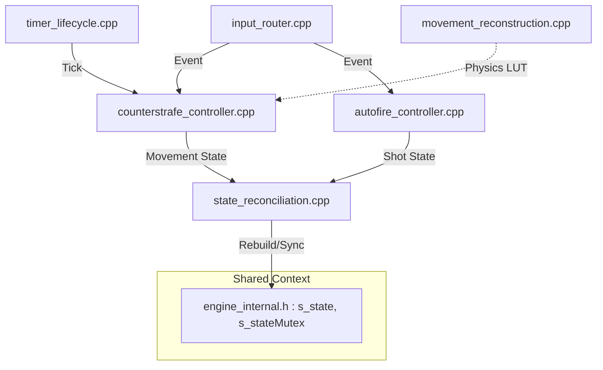
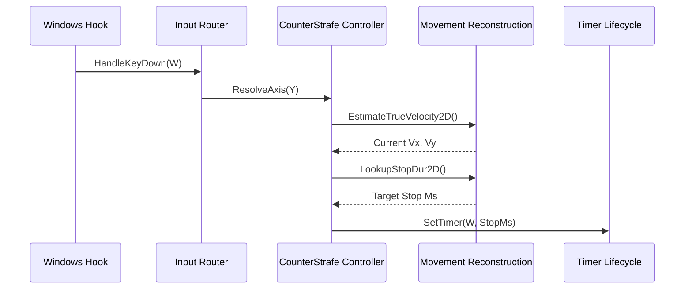
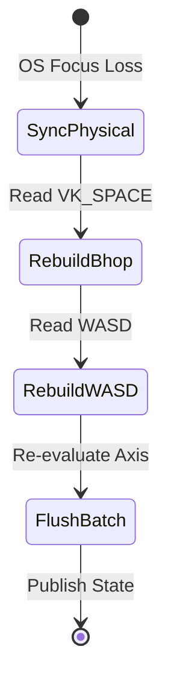

# Counter-Strafe V26 Architecture

This document describes the modular architecture of the Counter-Strafe Engine V26.

## Module Decoupling

The engine has been decoupled from a monolithic `state_engine.cpp` into 6 distinct sub-systems:

## Lifecycle of a Key Press

## State Reconciliation

The `RebuildState` function uses a Local Snapshot pattern to synchronize logical state with OS physical state without blocking the hook thread.

## Regression CI Pipeline

The project features a standalone, headless deterministic simulator (`tools/forensics/deterministic_simulator.cpp`) that links against the physics engine directly to output CSV dumps for regression testing (`tools/run_regression.py`). This guarantees zero gameplay variation across refactors.
