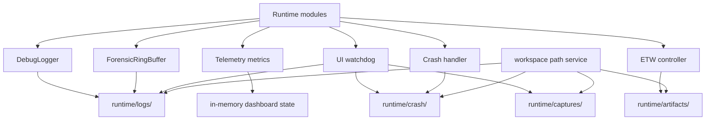

# Observability Map

Date: 2026-05-30

## Ownership Model

| Area | Owner | Writes | Where | When | Why |
|---|---|---|---|---|---|
| Debug logging | `dlog` | Subsystem text logs | `runtime/logs/marco_debug.log` | Runtime events through `DLOG_*` | Developer diagnostics |
| Forensics | `telemetry` forensic ring | Anomaly events | `runtime/logs/marco_*.log` | Auto flush and lifecycle flushes | Reconstruct intermittent failures |
| Telemetry metrics | `telemetry` buffers/UI | In-memory counters and ETW events | Memory / ETW provider | Runtime sampling | Dashboard and performance visibility |
| ETW diagnostics | `etw_controller` | Kernel trace | `runtime/artifacts/performance_trace.etl` | ETW start/stop | Scheduler/DPC/ISR analysis |
| UI watchdog | `ui_diagnostics` | Stall log, screenshot, dump | `runtime/logs/`, `runtime/captures/`, `runtime/crash/` | UI stall detection | Freeze diagnostics |
| Crash marker | `main` crash handler | Startup phase crash log | `runtime/crash/startup_crash.log` | Severe exception | Crash triage |
| Analysis exports | `analysis_toolkit` caller | CSV/JSON/baseline | User-chosen path | Explicit export | User-requested analysis |

## Diagram

## Governance

- `workspace` owns all implicit runtime output locations.
- Observability producers choose event content and trigger timing, not directories.
- Generated analysis outputs default to `runtime/artifacts/`.
- Crash-specific outputs must not be mixed into logs or artifacts.

## Status

EXECUTED: telemetry/forensics/debug/crash audit.
EXECUTED: ownership model.
EXECUTED: observability diagram.
