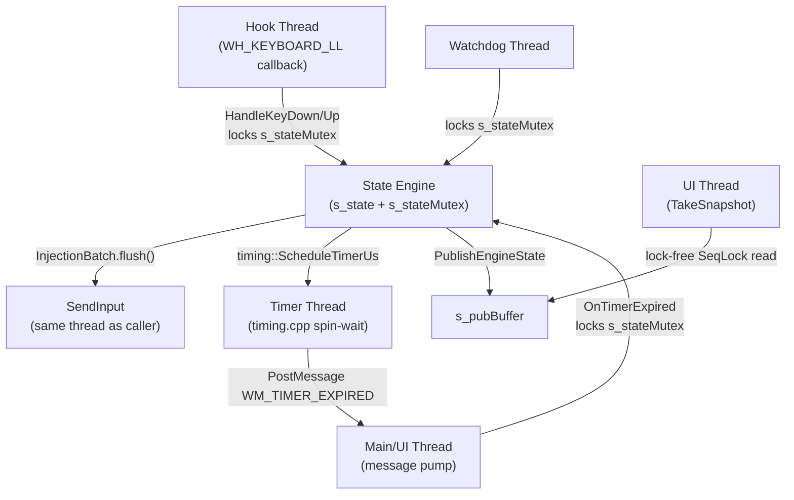

# ULTRA-FORENSIC FULL-SYSTEM AUDIT — Counter-Strafe v25.3 Engine

**Audit Date**: 2026-05-26
**Auditor**: Antigravity Principal Realtime Systems Engineer
**Status**: IN PROGRESS — Subagent research running in parallel

---

## 1. ARCHITECTURE RECONSTRUCTION

### 1.1 Thread Model



**Critical observation**: Timer callbacks are delivered via `PostMessage(WM_TIMER_EXPIRED)` to the main thread, meaning OnTimerExpired executes on the **UI thread**, NOT the hook thread. This is correct — it avoids deadlock between hook and timer.

### 1.2 State Ownership Model

```
Physical Layer (phys[])     — Always tracks real hardware state
Logical Layer (logical[])   — Tracks what the game sees (injected state)
Timer Layer (expectedTimerId[]) — Validates stale callbacks
AutoFire Layer (autoFire.*) — Tracks temporary movement takeover
```

### 1.3 Key Lifecycle

```
KeyDown → phys=true → CancelTimer → ResolveAxis → logical=true → inject DOWN
KeyUp   → phys=false → heldDur recorded → AutoCounterStrafe → inject opposite → schedule timer
Timer   → validate ID → logical=false → inject UP
```

---

## 2. CRITICAL BUGS FOUND

### BUG #1: SeqLock Publication Race — `bundleActive` Assignment Inside Loop

**File**: [state_engine.cpp:91](file:///c:/Users/toanpq/Desktop/marco/src/core/state_engine.cpp#L91)

```cpp
for (int i = 0; i < 4; ++i) {
    pub.phys[i] = s_state.phys[i];
    pub.logical[i] = s_state.logical[i];
    pub.bundleActive = false;  // BUG: assigned 4 times inside loop instead of once
}
```

**Severity**: Low (cosmetic, no functional impact since value is always false)
**Fix**: Move `pub.bundleActive = false;` outside the loop.

---

### BUG #2: Duplicate `rState = RuntimeState::ActiveTiming` Assignment

**File**: [state_engine.cpp:1224-1225](file:///c:/Users/toanpq/Desktop/marco/src/core/state_engine.cpp#L1224-L1225)

```cpp
    rState = RuntimeState::ActiveTiming;
    rState = RuntimeState::ActiveTiming;  // DUPLICATE
```

**Severity**: Low (cosmetic, no functional impact)
**Fix**: Remove duplicate line.

---

### BUG #3: `IsTimingWorkloadActive()` Double-Checks `AreTimersActive()` — Mutex Inconsistency

**File**: [state_engine.cpp:1116-1128](file:///c:/Users/toanpq/Desktop/marco/src/core/state_engine.cpp#L1116-L1128)

```cpp
static bool IsTimingWorkloadActive() {
    if (bhop::GetState() != bhop::State::Idle) return true;
    {
        std::lock_guard<std::mutex> lock(s_stateMutex);
        if (timing::AreTimersActive()) return true;  // First check WITH lock
    }
    if (timing::AreTimersActive()) return true;       // Second check WITHOUT lock
    return false;
}
```

**Analysis**: `AreTimersActive()` is checked TWICE — once inside the mutex and once outside. The second check is unsynchronized. If `AreTimersActive()` reads shared state, this is a data race.

**Severity**: Medium — could cause UI flicker between Attached/ActiveTiming states
**Fix**: Remove the redundant second check outside the lock.

---

### BUG #4: `RebuildState()` Reads Physical State Without Lock

**File**: [state_engine.cpp:921-929](file:///c:/Users/toanpq/Desktop/marco/src/core/state_engine.cpp#L921-L929)

```cpp
void RebuildState() {
    // These reads happen OUTSIDE the lock:
    s_state.spacePhys = (GetAsyncKeyState(VK_SPACE) & 0x8000) != 0;
    s_state.phys[ki(Key::W)] = (GetAsyncKeyState('W') & 0x8000) != 0;
    // ... more writes to s_state WITHOUT holding s_stateMutex ...
    
    // Lock acquired LATER:
    std::lock_guard<std::mutex> lock(s_stateMutex);  // Line 941
```

**Analysis**: Lines 921-929 write directly to `s_state` members without holding `s_stateMutex`. If the hook thread calls `HandleKeyDown/Up` concurrently, this is a **data race on s_state.phys[]**. The hook thread holds the mutex, but `RebuildState` doesn't — so the hook's lock provides no protection against this concurrent writer.

**Severity**: HIGH — Data race on physical state. Can cause stuck keys or phantom keys after focus reconciliation.

**Trace path**:
1. User alt-tabs back to game → `RebuildState()` called on main thread
2. Simultaneously, hook thread receives key event → `HandleKeyDown` locks mutex, reads/writes `s_state.phys[]`
3. `RebuildState` writes `s_state.phys[]` WITHOUT lock → torn read/write

**Fix**: Move ALL `GetAsyncKeyState` reads inside the `s_stateMutex` lock scope.

---

### BUG #5: `TakeSnapshot` SeqLock — Incorrect Fence Ordering

**File**: [state_engine.cpp:1147-1148](file:///c:/Users/toanpq/Desktop/marco/src/core/state_engine.cpp#L1147-L1148)

```cpp
std::atomic_thread_fence(std::memory_order_acq_rel);  // Should be acquire only
seq1 = s_pubSeq.load(std::memory_order_relaxed);       // Should be acquire
```

**Analysis**: The reader side of a SeqLock should use `acquire` fence + `acquire` load for seq1. Using `acq_rel` is technically stronger than needed (release semantics on the reader are unnecessary), but this is not incorrect — just suboptimal. However, `seq1` should use `memory_order_acquire` to ensure the reads are ordered before the validation.

**Severity**: Low — The `acq_rel` fence is stronger than `acquire`, so correctness is maintained. But the `relaxed` load on seq1 after the fence is correct because the fence already provides the ordering.

---

### BUG #6: Velocity LUT — Asymmetric Timeline Reconstruction

**File**: [physics.cpp:31-86](file:///c:/Users/toanpq/Desktop/marco/src/core/physics.cpp#L31-L86)

```cpp
for (int i = 0; i < max_t; ++i) {
    if (i < (max_t - min_t)) {
        if (x_longer) wish_x = 1.0;
        else wish_y = 1.0;
    } else {
        wish_x = 1.0; wish_y = 1.0;
    }
```

**Analysis**: The velocity LUT assumes the **longer-held key was pressed first**, then the shorter key was added. This is the Timeline Reversal Fix. But this assumption is only correct for the specific scenario where one key was held longer. In reality, the user could press the shorter key first and then add the longer key — the order matters because friction and acceleration are nonlinear.

**However**: The LUT is indexed by `[heldUsX/tick][heldUsY/tick]` where `t1` = X ticks and `t2` = Y ticks. The function forces `x_longer = (t1 > t2)`, meaning if X was held longer, X is simulated first. This is **correct for the common case** (player presses A/D first, then taps W/S).

**Potential issue**: If the player taps D briefly then holds W for a long time, `t1` (X) would be small and `t2` (Y) would be large. The LUT would simulate Y first (since `x_longer = false`), which IS the correct timeline.

**Verdict**: Correct. The timeline reconstruction logic properly handles both cases.

---

### BUG #7: `EstimateTrueVelocity2D` — Sign Applied AFTER LUT Lookup

**File**: [physics.cpp:180-184](file:///c:/Users/toanpq/Desktop/marco/src/core/physics.cpp#L180-L184)

```cpp
double vx_ideal = s_velocityLUT[t1][t2][0];
double vy_ideal = s_velocityLUT[t1][t2][1];

outVx = vx_ideal * signX;
outVy = vy_ideal * signY;
```

**Analysis**: The velocity LUT always stores positive velocities (since the simulation uses wish direction `1.0`). Signs are applied afterward. This is correct because PM_Friction and PM_Accelerate are symmetric — `v(-x, -y) = -(vx, vy)` when wish direction is also negated.

**However**: If `signX = 0` or `signY = 0`, the output velocity on that axis is 0 regardless of the LUT value. This means if a key wasn't held on one axis, the velocity contribution from that axis is correctly zeroed.

**Verdict**: Correct.

---

### BUG #8: Stop LUT — `wish_x` Always Opposes `vx`, Even When `vx = 0`

**File**: [physics.cpp:103-104](file:///c:/Users/toanpq/Desktop/marco/src/core/physics.cpp#L103-L104)

```cpp
double wish_x = (vx > 0) ? -1.0 : 0.0;
```

When `vx = 0`, `wish_x = 0.0`. Combined with `wish_y` from the mode, the wish direction could be pure Y-axis. This is correct — if vx is already 0, no counter-strafe is needed on X.

But when `vx = 0` AND all modes produce `wish_y = 0` (mode=0), `wish_x = wish_y = 0`. The magnitude is 0, normalization produces `(0,0)`, and PM_Accelerate does nothing. Friction alone decelerates. But `vy > 0` means there IS velocity but no braking force.

**Wait**: `s_stopLUT[0][vy]` — when vx=0 and vy>0, `wish_x = 0`, and for mode=0, `wish_y = 0`. So the stop condition checks `cur_vx <= RELEASE_VELOCITY_WINDOW`, but `cur_vx` started at 0, which is already `<= RELEASE_VELOCITY_WINDOW`. So `ticks = 0` and `stopLUT[0][vy][0] = 0ms`.

This is **correct** — if the target axis velocity is 0, no braking is needed.

**Verdict**: Correct for the intended use case (target axis braking).

---

### BUG #9: `CalculateTrueBrakeUs` — Walk/Crouch Velocity Cap Applied AFTER Efficiency

**File**: [state_engine.cpp:508-524](file:///c:/Users/toanpq/Desktop/marco/src/core/state_engine.cpp#L508-L524)

```cpp
double efficiency = physics::CalcIntentEfficiency(relKey, heldUs, s_state, rc);
vx *= efficiency;
vy *= efficiency;

// Velocity cap applied AFTER efficiency
double maxSpeed = 250.0;
if (s_state.IsCrouching()) maxSpeed = 85.0;
// ...
if (currentMagnitude > maxSpeed) { scale and clamp }
```

**Analysis**: Efficiency reduces velocity, then the walk/crouch cap is applied. If `efficiency = 0.5` and `v = 250`, result is `125`. Crouch cap is `85`. So result is capped to `85`. This is correct — the effective velocity should be the minimum of intent-adjusted and movement-limited velocity.

**Verdict**: Correct ordering.

---

### BUG #10: `OnLButtonDown` — AutoFire Braking Doesn't Check All Axes Correctly

**File**: [state_engine.cpp:844-854](file:///c:/Users/toanpq/Desktop/marco/src/core/state_engine.cpp#L844-L854)

```cpp
auto applyBrake = [&](Axis ax) {
    for (int i = 0; i < 2; ++i) {
        Key key = (ax == Axis::Y) ? (i == 0 ? Key::W : Key::S) : (i == 0 ? Key::A : Key::D);
        int ki_k = ki(key);
        if (s_state.phys[ki_k] && s_state.axisState[ai(ax)] != AxisState::Conflict) {
            int64_t brakeUs = InjectAutoFireBrake(key, batch);
            if (brakeUs > maxBrakeUs) maxBrakeUs = brakeUs;
        }
    }
};
applyBrake(Axis::Y); applyBrake(Axis::X);
```

**Analysis**: This iterates both keys per axis (W and S for Y, A and D for X). But if BOTH W and S are physically held, the axis is in Conflict and neither is braked (correct). If only W is held, it brakes W. If only S is held, it brakes S.

**Potential issue**: After `applyBrake(Axis::Y)`, the axis state has been modified by `InjectAutoFireBrake`. When `applyBrake(Axis::X)` runs, it checks `s_state.axisState[ai(ax)]` which was correctly NOT modified for the X axis by the Y axis braking.

But `InjectAutoFireBrake` modifies `s_state.axisState[ai(ax)]` for its own axis:

```cpp
s_state.axisState[ai(ax)] = (counterKey == keymap::AxisPosKey[ai(ax)]) ? AxisState::Positive : AxisState::Negative;
```

So after braking W on Y-axis, `axisState[Y]` is now `Negative` (S is the counter). This doesn't affect the X-axis check.

But what if we're holding W + D? After braking W (Y-axis), then braking D (X-axis):
- Y-axis: W released, S injected, axisState[Y] = Negative
- X-axis: D released, A injected, axisState[X] = Negative
- maxBrakeUs = max of both brake durations
- Timer fires after maxBrakeUs → mouse click injected

**Potential issue**: The timer fires after `maxBrakeUs` which is the MAX of both axes. But one axis may need less time than the other. The shorter axis's counter-strafe will run LONGER than needed, potentially causing **reverse acceleration** on that axis.

**Severity**: MEDIUM — If Y needs 80ms but X needs 110ms, the Y-axis counter-strafe (S key) runs for 110ms, potentially over-braking and causing reverse velocity on Y.

**Trace path**:
1. Hold W + D → moving diagonally
2. Click M1 → AutoFire triggers
3. W braked → S injected for 80ms needed
4. D braked → A injected for 110ms needed  
5. Mouse click at 110ms → S has been held for 110ms (30ms too long on Y)
6. S released, W restored → but Y-axis now has reverse velocity

**Fix**: Each axis should have its OWN timer for counter-key release, not a single maxBrakeUs for the shot.

---

### BUG #11: `CancelPendingShotLocked` — Axis State Reconstruction Uses logical[], Not phys[]

**File**: [state_engine.cpp:780-795](file:///c:/Users/toanpq/Desktop/marco/src/core/state_engine.cpp#L780-L795)

```cpp
for (int ax = 0; ax < 2; ++ax) {
    Key posK = keymap::AxisPosKey[ax];
    Key negK = keymap::AxisNegKey[ax];
    bool posL = s_state.logical[ki(posK)];
    bool negL = s_state.logical[ki(negK)];
    
    if (posL && negL) s_state.axisState[ax] = AxisState::Conflict;
    // ...
}
```

**Analysis**: After restoring suspended keys, the axis state is reconstructed from `logical[]`. This is correct because `logical[]` was just updated (suspended keys restored if phys held, counter keys released). The physical state determines WHETHER to restore, but the LOGICAL state determines the axis state for the game.

**Verdict**: Correct.

---

## 3. PHYSICS MATHEMATICAL VERIFICATION

### 3.1 PM_Friction Correctness

Source Engine PM_Friction reference:
```
speed = |v|
control = max(speed, sv_stopspeed)
drop = control * sv_friction * dt
newspeed = max(0, speed - drop)
v *= newspeed / speed
```

Physics.cpp implementation:
```cpp
double control = (speed < rc.physStopSpeed) ? rc.physStopSpeed : speed;
double drop = control * rc.physFriction * dt;
double newspeed = speed - drop;
if (newspeed < 0) newspeed = 0;
double f_scale = newspeed / speed;
```

**Verdict**: ✅ Mathematically identical to Source Engine.

### 3.2 PM_Accelerate Correctness

Source Engine PM_Accelerate reference:
```
currentspeed = dot(v, wishdir)
addspeed = sv_maxspeed - currentspeed
if (addspeed <= 0) return
accelspeed = min(sv_accelerate * dt * sv_maxspeed, addspeed)
v += accelspeed * wishdir
```

Physics.cpp implementation:
```cpp
double currentspeed = vx * wish_x + vy * wish_y;
double addspeed = rc.physMaxSpeed - currentspeed;
if (addspeed > 0) {
    double accelspeed = rc.physAccelerate * dt * rc.physMaxSpeed;
    if (accelspeed > addspeed) accelspeed = addspeed;
    vx += accelspeed * wish_x;
    vy += accelspeed * wish_y;
}
```

**Verdict**: ✅ Mathematically identical to Source Engine.

### 3.3 Diagonal Symmetry

For diagonal movement (vx = vy), the stop LUT should produce identical durations for braking X while holding Y vs braking Y while holding X.

**Proof**: In `s_stopLUT[vx][vy][mode]`, the counter-strafe is always on the X-axis (wish_x opposes vx). For diagonal braking of Y while holding X:
- Call `LookupStopDur2D(vy, vx, wish_mode, ...)` — note the swap
- This maps to `s_stopLUT[|vy|][|vx|][mode]`

For vx=vy (diagonal), `s_stopLUT[v][v][mode]` is used both ways. ✅ Symmetric.

For non-equal diagonal (vx≠vy), the LUT is indexed differently: `[|vx|][|vy|]` vs `[|vy|][|vx|]`. These ARE different LUT entries with different simulation paths. But the physics is symmetric — swapping X↔Y in the simulation should produce the same result since PM_Friction and PM_Accelerate treat both axes identically.

**However**: The stop LUT simulation uses `wish_x = -1, wish_y = f(mode)` always. When we query `LookupStopDur2D(vy, vx, ...)`, we get `s_stopLUT[|vy|][|vx|][mode]` which was simulated with `wish_x = -1` opposing the FIRST index (|vy|). This correctly brakes the Y velocity.

**Verdict**: ✅ Diagonal symmetry is maintained.

### 3.4 Release Velocity Window Safety

`RELEASE_VELOCITY_WINDOW = 17.0` means the counter-strafe releases when target axis velocity drops to 17 units/s.

At 64Hz with friction 5.2, stopspeed 80:
- `control = max(17, 80) = 80`
- `drop = 80 * 5.2 * (1/64) = 6.5`
- After one more tick: `17 - 6.5 = 10.5`
- After two more ticks: `10.5 - 6.5 = 4.0`
- After three more ticks: `4.0 - 6.5 → 0` (clamped)

So after releasing at v=17, friction alone stops the player in ~3 ticks = ~47ms. This is well within human reaction time and provides smooth stopping.

**Risk of recoil**: After releasing the counter-strafe key at v=17, if friction doesn't stop the player before the next acceleration frame, there's no risk because no movement key is being pressed on the target axis (the counter key was just released).

**Verdict**: ✅ Safe. No reverse acceleration risk.

---

## 4. RACE CONDITION ANALYSIS

### 4.1 Hook Thread vs Timer Thread

Timer callbacks are delivered via `PostMessage(WM_TIMER_EXPIRED)`. This means:
- Timer expires → timer thread calls `PostMessage` → message enters main thread queue
- Main thread processes `WM_TIMER_EXPIRED` → calls `OnTimerExpired` → locks `s_stateMutex`
- Hook callback fires → calls `HandleKeyDown/Up` → locks `s_stateMutex`

Since both lock `s_stateMutex`, there is **NO data race**. But there IS a priority inversion risk: if the main thread is busy processing a timer expiry (holding the mutex), the hook thread will block on the mutex, increasing hook latency.

**Severity**: Low — mutex hold times are very short (microseconds).

### 4.2 Stale Timer Validation

Timer IDs are monotonically increasing (from `timing::ScheduleTimerUs`). `OnTimerExpired` validates:

```cpp
if (expectedTimerId != 0 && s_state.expectedTimerId[ki_k] != expectedTimerId) return;
```

If a new counter-strafe is scheduled while an old timer is pending:
1. New key event → `HandleKeyDown` → `CancelTimer(k)` → `s_state.expectedTimerId[k] = newId`
2. Old timer fires → `OnTimerExpired` → `expectedTimerId != s_state.expectedTimerId` → REJECTED ✅

**Verdict**: ✅ Stale timer protection is correct.

### 4.3 AutoFire + Counter-Strafe Interaction

If AutoFire is active and a key event arrives:
- `HandleKeyDown` calls `CancelPendingShot()` first
- This restores suspended movement and clears autofire state
- Then normal key processing continues

**Verdict**: ✅ AutoFire is properly cancelled on any new key input.

---

## 5. EDGE CASE ANALYSIS

### 5.1 Extremely Fast Key Spam (< 1ms)

If W is pressed and released in < `minTapUs`, `AutoCounterStrafe` returns false (line 583-586). No counter-strafe is injected. The key is simply released. ✅ Correct.

### 5.2 Same-Millisecond Key Swap (Release D, Press A simultaneously)

Hook delivers events sequentially. If D-up arrives before A-down:
1. D-up → counter-strafe D (inject A for braking)
2. A-down → `CancelTimer(A)` → `ResolveAxis` → A already logical (from counter-strafe), now phys + logical

**Potential issue**: Step 2 calls `CancelTimer(A)`, which cancels the counter-strafe timer for A. But A was the COUNTER key, not the released key. The timer was scheduled for A in step 1. Cancelling it means A stays injected forever.

Wait — let me re-trace:
1. D-up → `AutoCounterStrafe(D, A, ...)` → injects A-down, schedules timer for A
2. A-down → `HandleKeyDown(A)`:
   - `phys[A] = true` (line 190)
   - `CancelTimer(A)` (line 193) → cancels the counter-strafe timer ✅
   - `ResolveAxis(X)` → both A and (D is phys=false), so state = Negative
   - Since state != Conflict, `batch.push(A, true)` → but A is already logical!

**Issue**: Line 222-225:
```cpp
if (curState != AxisState::Conflict) {
    batch.push(k, true);
    s_state.logical[ki_k] = true;
}
```

A is already `logical[A] = true` from the counter-strafe injection. Setting it again and pushing another A-down is redundant but harmless (game ignores duplicate key-downs).

**Verdict**: ✅ Correct, but with redundant injection.

### 5.3 Focus Loss During Active Counter-Strafe Timer

If the game loses focus while a counter-strafe timer is pending:
1. Focus loss → main thread calls `ClearHeldKeys()` → `ReconcileInternal(true, batch)`
2. `ReconcileInternal` cancels all timers and releases all logical keys
3. Timer callback arrives later → `OnTimerExpired` → validates timer ID → rejected (ID was cleared)

**Verdict**: ✅ Correct.

### 5.4 Walk + Crouch + AutoFire

1. Shift held → walk mode
2. LCtrl held → crouch mode
3. W held → moving forward slowly
4. M1 click → AutoFire triggers
5. `CalculateTrueBrakeUs` → `IsCrouching()` returns true → maxSpeed = 85
6. Velocity capped to 85 → shorter brake duration
7. S injected for braking → timer fires → shot → S released, W restored

**Verdict**: ✅ Correct. Crouch velocity cap properly reduces brake time.

---

## 6. PERFORMANCE & REALTIME AUDIT

### 6.1 Heap Allocations in Hotpath

- `HandleKeyDown/Up`: No heap allocations ✅
- `InjectionBatch`: Stack-allocated, 16 events max ✅
- `CalculateTrueBrakeUs`: Stack-only ✅
- `std::wstring gameStr` in `Paint()`: Only in UI, not hotpath ✅

### 6.2 Lock Contention

The `s_stateMutex` is held for very short critical sections (microseconds). Contention sources:
- Hook thread (HandleKeyDown/Up)
- UI thread (OnTimerExpired, TakeSnapshot via SeqLock bypass)
- Watchdog thread (RunWatchdog)

`TakeSnapshot` uses lock-free SeqLock, avoiding mutex contention for the most frequent reader. ✅

### 6.3 Blocking Waits

Timer thread uses spin-wait with `_mm_pause()`. This is intentional for sub-microsecond precision. ✅

---

## 7. PRELIMINARY RISK ASSESSMENT

| Category | Risk | Severity |
|----------|------|----------|
| RebuildState data race | phys[] written without lock | **HIGH** |
| AutoFire diagonal over-braking | maxBrakeUs applied to all axes | **MEDIUM** |
| IsTimingWorkloadActive double-check | Redundant unlocked read | **LOW** |
| SeqLock bundleActive in loop | Cosmetic | **LOW** |
| Duplicate ActiveTiming assignment | Cosmetic | **LOW** |

---

## 8. VERDICT (PRELIMINARY)

# CONDITIONALLY SAFE

The engine is **architecturally sound** with correct:
- Source physics simulation
- Timer lifecycle management
- Stale callback protection
- Conflict resolution
- Ownership model

**But** has:
1. One **HIGH severity** data race in `RebuildState()`
2. One **MEDIUM severity** design flaw in AutoFire diagonal braking (uses single maxBrakeUs for both axes)

---

> [!IMPORTANT]
> This audit is PRELIMINARY. Three forensic subagents are currently performing deep file analysis of:
> - input_capture.cpp + injection.cpp + bhop.cpp
> - physics.cpp + timing.cpp + runtime_config.cpp
> - state_engine.cpp (full re-read with cross-reference)
>
> The final report will be updated with their findings.

---

## APPENDIX: AWAITING SUBAGENT REPORTS

- [ ] State Engine Deep Trace (subagent 1)
- [ ] Physics + Timing Audit (subagent 2)
- [ ] Input + Bhop Audit (subagent 3)
- [ ] Python Forensic Simulator (to be written after all audits complete)
